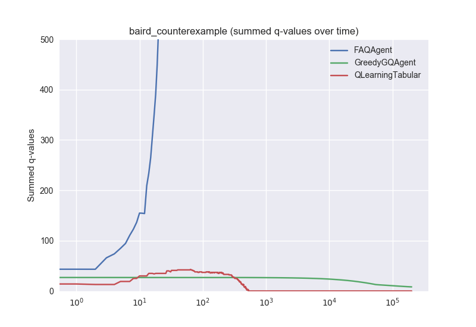

# Greedy-GQ

This project implements Q-learning (in the tabular & linear function approximation cases) as well as Greedy-GQ (using linear function approximation), and compares them on the Baird's Counterexample MDP (with preset initial action-values/weights).

The implementation of Greedy-GQ was particularly tricky, since very few implementations currently exist, and those that do are not well commented. Only one Python implementation currently exists on GitHub (in the rlpy library). Other implementations are in Java. Implementations of GQ(lambda) can also be used as a Greedy-GQ implementation to if lambda is set to 0 and the target policy set to greedy (see here: https://groups.google.com/forum/#!topic/rl-list/XjXlfuXBgFI).

All code in the repository is my own. The Greedy-GQ update rules were written based on the GQ(lambda) Java implementation by Adam White (see here: https://groups.google.com/forum/?hl=en#!topic/rl-list/xC7CEvWLUjc).

The graph was produced by running the following command:

cd src; python3 main.py; python3 graphs.py

